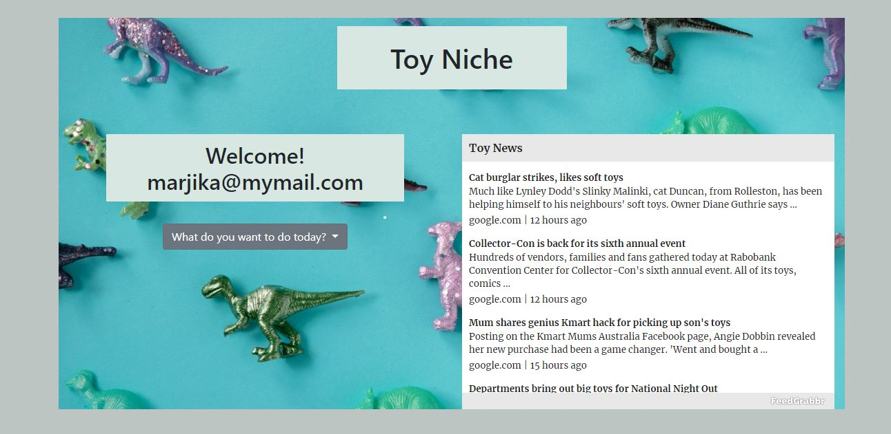
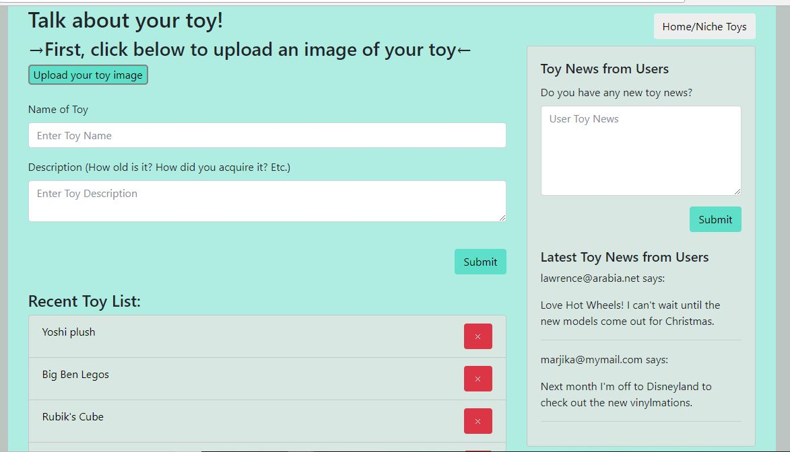
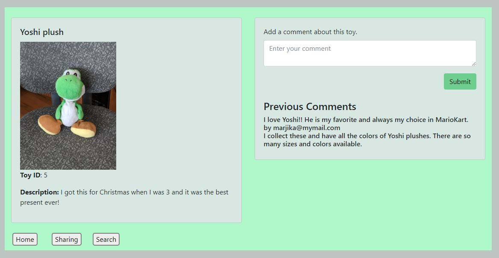
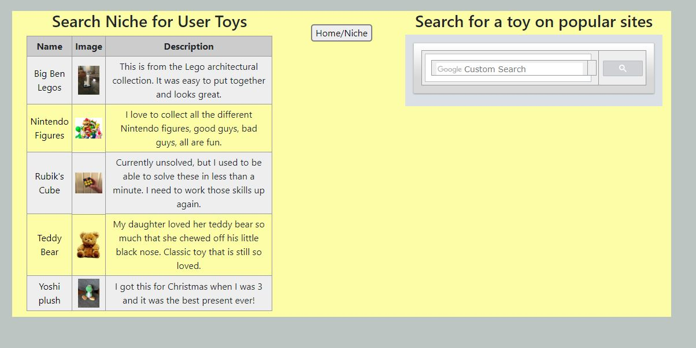

# ProjectPTM
<b>TOY NICHE</b>
 

Project #2

  

<b>Requirements to complete the project:</b>
 

** Must use a Node and Express Web Server

Sequelize is used to create and work with the database. Middleware includes BodyParser.  Passport NPM is used for user authentication.
 
** Must be backed by a MySQL Database with a Sequelize ORM  

Models (ORM) for Toy, General (News/Commenting), and User
 
** Must have both GET and POST routes for retrieving and adding new data

Toy Niche uses all parts of the CRUD model: Create--Toy, comment, and user tables; Read-Select toys, comments, and current user and displays the respective table data; Update-Toy comments section can be added to and updated; Delete-Toys in the recent toy list may be deleted.
 
** Must be deployed using Heroku (with Data)

Toy Niche is deployed at https://vast-atoll-87710.herokuapp.com/
 
** Must utilize at least one new library, package, or technology that we haven’t discussed

Several new features include: User login, Cloudinary for image handling, test.js files, dropdown menu, Handlebars table templating, Handlebars partials and helpers, and use of a Feedgrabbr widget and a Google custom search engine.
 
** Must have a polished frontend / UI
 
** Must have folder structure that meets MVC Paradigm
 
** Must meet good quality coding standards (indentation, scoping, naming)
 
** Must protect API keys in node with environment variables

We used widgets and did not need API keys.
 

  

<b>Instructions:</b>

 

Don't forget to type "npm install" the npm packages that are required for this project. Then type "node server.js", you should able to see the link for the listening on port then you should be good to go. Click on the link to see the web page.

 

Our project allows you to create a login then sign in and logout to see your account. In the homepage, it has a Toy Newsfeed that will upload daily with the latest news. The main pages uses a dropdown menu to direct the client. If the user is logged in, his or her email appears after the "Welcome" message.

 

You can also share your toy by uploading your toy image and adding the name of the toy and description into it. Once you click submit, it gives you the recent toy list and you can click on the specific toy to see the info. You can add a comment about that toy in the page. Then in the same page you can add "Toy News from you as the user" so others can see commentary about that specific toy.  On the sharing page, both the general comments and recent toys display the most recent at the top.  You may comment on a specific toy whether you're logged in or not, but you must be a logged-in user to make a general toy news comment.  If not logged in, a modal will pop up to remind the client to sign in.

 

In our search toy page, you can see all the toys, in alphabetical order, including info that has been uploaded by the users.  You can also link to the specific toy page by clicking on the toy name.  You can search for a toy on popular sites such as Amazon, ebay, etc. with a Google custom search engine.

 

The login page should work properly

  

<b>Contributors:</b>
 
Marjika Howarth
 
Therisia Welker Hadley
 
Perla Riojas
  

<b>Have Fun!</b>